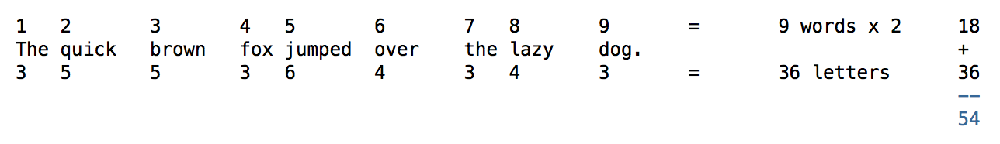
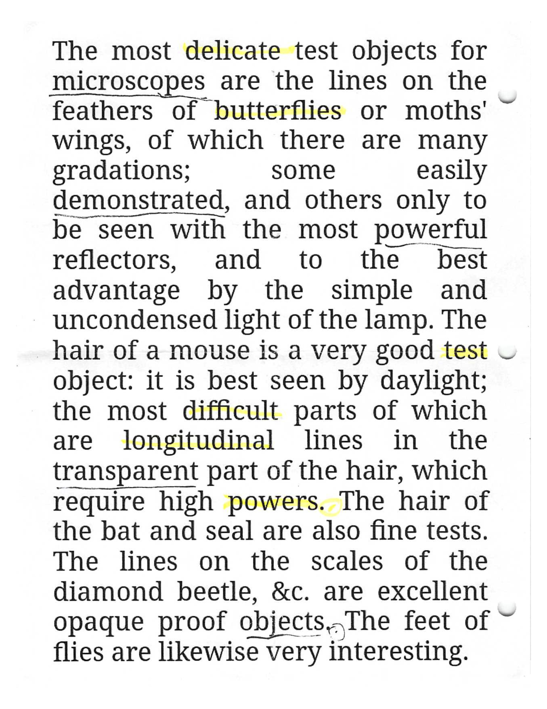

# Eraceur Rules v1.2
### (c) 2020 Richard D. Allen / rchrdlln at gmail dot com

### Number of Players

2 to 4

### Time to Play 

15-30 minutes

### Equipment

+ Pages of text (from [Eraceur Pages, Set One](https://www.github.com/rchrdlln/blob/master/eraceur/Eraceur_Pages_Set_One.pdf), or of your choosing)
+ 1 pen of different color for each player
+ score sheet
+ Timer (for Speed Eraceur)

### Game Play

The youngest player goes first. In subsequent rounds the player to go first is the player immediately to the right of the player who previously went first. 

Play moves counterclockwise. Each player must use a highlighter or similar pen with a distinctive color of ink.

Player 1 highlights a word using their pen. This word becomes the first word of Player 1's sentence. It cannot be used by any other player. 

Next, Player 2 highlights a word with their pen, which becomes the first word of Player 1's sentence. 

Play continues in this manner until one player designates the word they have selected as the last word in their proposed sentence by either underlining it twice or placing a period with a circle after it - whichever is more visible. 

After any player has ended their sentence, the other players each have one more turn to select a last word. 

Sentences must be at least three words long and no more than ten words long, although sentences longer than ten words are unlikely in any event. 

After the round ends, players total their scores on the scoresheet using the formula listed below.

Any player who fails to complete a grammatical sentence before the round ends receives zero points for the round.

After the round ends, in order to increase readability, players may add punctuation to their sentences. Capitalizing initial letters is not necessary. 

### Prohibited Actions

Players cannot, whether intentionally or unintentionally, create a sentence that already exists on the page. 

Players cannot rearrange words in their sentences. They must use words in the order selected. 

### Challenges

In games of more than two players, if any player believes in good faith that the sequence of words selected by another player does not constitute a sentence, that player may issue a challenge, to be adjudicated by the player(s) who are neither the challenger nor the challenged. 

In the event of questions about whether a sentence is grammatical, whether it is a sentence fragment, etc, players may designate an official reference for questions of grammar, usage, etc at any point before game play begins. 

### Slam Round

If three or more players have completed at least three rounds, the players may elect to end the game with a slam round in which each player rearranges two or more of the sentences they previously created into a poem, which they are encouraged to perform. Players may change or add line breaks, punctuation, etc as necessary.

Each player's poem is scored on a ten-point scale, Olympic-style, by the judges (the other players). Players are encouraged to create their own scoring systems using standards of evaluation such as: brevity, profundity, humor, and formal skill (is the poem a haiku? Does it rhyme?) The judges' scores are added together to obtain the player's slam round score.   

The winner of the slam round adds two rounds to their overall point total. Thus, if the slam round is Round 10, and after 9 rounds, Player A has won 2 rounds, Player B 3 rounds, and Player C 4 rounds, if Player A wins the slam round, Player A's final total will be 4 points, tying Player C for first place. 

Two-player games may conduct a slam round, but, unless the players swear to each other a solemn oath to value poetry and its art and craft more highly than the selfish desire to win games and thus to reject any temptation to select their own poem for any untoward end, two-player slam rounds should remain unscored.   

### Gameplay Variations

+ Blackout: At the conclusion of each move after each player's initial move, each player crosses out (erases) every word between their newly selected word and their previous word, skipping over those words already selected by other players and any already crossed out. This variation could theoretically be abused by the player 

+ High-Low, or The Miniaturist (3+ players): The player whose completed sentence uses the _fewest_ total letters receives a score equal to the highest score in the round minus five points. A player may thus pursue a second-best strategy that forces other players to select desirable short words as a defensive maneuver.

+ Super Slam Round (3+ players): Players may use all words they previously selected, not only their completed sentences, in their final poem. If the player's final poem contains all of the words they previously selected, the player earns a twenty-five [fifty?] point bonus. This should create the possibility, in some circumstances, of a player creating few or no valid sentences in total in favor of acquiring an especially good selection of words for the Slam Round. 

+ Slam Round Variant 1: Players must use all of the sentences they created in their final poem.

+ Slam Variant 2: players may mix and match the words of their previous sentences to create their new poem. 

+ High-Low: In order to qualify for this scoring variation, the total sentence score must be fifteen points or less. 

+ Speed Eraceur: Use a timer and require each player to select a word within a set amount of time. Try ten, fifteen, or thirty seconds. 

+ Single-Text Eraceur: Find a suitable book and confine all gameplay to that book, choosing pages at random. 

### Scoring

Each player's score per round equals two (2) times the number of words plus the total number of letters in their words. 

### End of the Game

+ Long Version: Each page is scored as a separate round. The first player to win a set number of rounds wins the game. The default is four.

+ Short Version: Pages are scored cumulatively. The first player to reach 154 points wins. 

## Gameplay and Scoring Example

In the accompanying image ("The most delicate test objects...") Player 1 uses a yellow highlighter. Player 2 uses a black pen. 

**Player 1**

"Delicate butterflies test difficult longitudinal powers."

6 words. 49 letters. (6 x 2) + 49 = 61 points. 

**Player 2**

"Microscopes demonstrated powerful transparent objects."

5 words. 49 letters. (5 x 2) + 49 = 59 points. 

